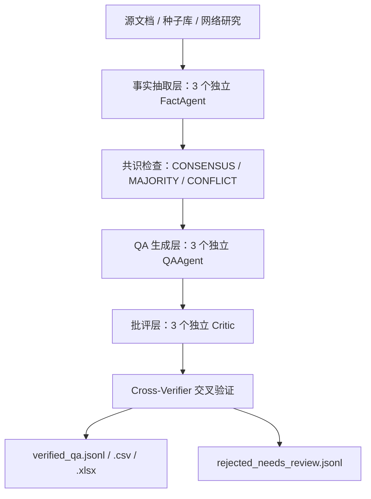

# MayGrove AI QA Evaluator Skill

> 一个为 **MayGrove AI 助手** 生成事实导向、多智能体验证的 QA 评测数据集的技能。适用于任何希望评估室内种植 AI 问答正确率、降低幻觉、并交付可直接给算法工程师使用的评估集的场景。

---

## 1. 这个技能解决什么问题

MayGrove AI 助手需要回答大量关于设备、种植、种子、饮食、情感闲聊等问题。要评估它答得对不对，需要：

- 有**真实来源**的问题和答案（说明书、种子库、App 需求文档）
- 覆盖**多种用户意图**和**不同用户人设**
- 经过**多轮验证**，减少幻觉和错误归因
- 输出格式能被算法工程师直接拿来做评测

这个技能把上述流程自动化：输入你的源文档，输出带引用、带置信度、带验证报告的 QA 数据集。

---

## 2. 创新点

相比传统“让模型直接生成一批问题答案”的评测集生产方式，这个技能在以下方面做了重新设计：

### 2.1 事实可溯源，而不是让模型凭记忆回答

每个 reference_answer 都绑定到具体源文档（说明书、种子库、App 需求文档）。无法追溯到来源的声明会被标记为 `source_gap`，并自动进入人工审核，避免把模型幻觉当作评测标准。

### 2.2 多智能体生成 + 多智能体批评，而不是单模型生成

采用 **3 × 3 × 3 流水线**：3 个独立事实抽取 → 3 个独立 QA 生成 → 3 个独立批评。最后由交叉验证器综合共识度和批评得分，给出最终置信度。这相当于给 QA 数据做了一次“同行评议”。

### 2.3 意图 × 人设矩阵，覆盖真实用户场景

不是随机出题，而是围绕 **7 大意图 × 4 种人设** 生成问题。这样能同时覆盖：用户问什么（意图）和用户是谁（人设），更贴近真实交互分布。

### 2.4 可解释的验证报告

输出不仅包含 QA 对，还包含：

- `verification_status`：是否通过验证
- `confidence`：最终置信度
- `facts`：支撑答案的事实来源
- `cross_verification_report.jsonl`：每个 QA 的多智能体讨论过程
- `rejected_needs_review.jsonl`：未通过的项及失败原因

算法工程师可以直接根据置信度分层采样或定位错误模式。

### 2.5 双模式生成：LLM 高质量流水线 + 确定性模板大批量生成

- **小批量（≤100 条）**：使用 LLM 多智能体流水线，追求高质量和覆盖度。
- **大批量（500–5000+ 条）**：使用 `generate_large_qa_set.py` 确定性模板，从解析后的源 JSON 直接生成，成本接近零，且保证事实引用不丢失。

### 2.6 失败项自动路由到人工审核

对于 **CONFLICT**（三个智能体冲突）、**SINGLE_ONLY**（仅单一来源）、关键安全项未通过、或最终置信度低于 0.8 的 QA，不会混入 `verified_qa.jsonl`，而是进入 `rejected_needs_review.jsonl`，确保交付数据集的质量下限。

### 2.7 不绑定特定 AI 平台

虽然它是 Hermes 技能，但核心资产（`templates/` 提示词、`scripts/` 脚本、`data/` 数据）不依赖 Hermes 私有 API。可以迁移到任何支持多智能体或提示词编排的 AI 框架中。

---

## 3. 核心原理

### 3.1 事实导向（Fact-Grounded）

每个答案必须能追溯到源文档。没有来源的声明会被标记为 `source_gap`，并进入人工审核队列。

### 3.2 7 大意图 × 4 种人设

| 意图 | 说明 | 典型来源 |
|---|---|---|
| PlantingTech | 种植技术：浇水、光照、营养液、育苗、病虫害 | V30 说明书 §7–§15 |
| ProductInquiry | 产品咨询：设备规格、安装、App 使用、配件 | V30 说明书 + Maygrove.md |
| GrowingPlan | 种植规划：档案、计划推荐、首批选种 | Maygrove.md 种植规划 |
| Lifestyle | 生活方式：摆放、送礼、亲子种植 | 说明书 + 品牌资料 + 网络研究 |
| ChatEmotional | 情感闲聊：打招呼、鼓励、日常对话 | Maygrove.md 人设库 |
| DietCooking | 饮食烹饪：食谱、收获后食用、营养 | 种子库 + 安全说明 + 网络研究 |
| OutofScope | 超范围话题：必须拒绝或引导 | 品牌边界策略 |

**4 种人设**：Newbie（新手）、Busy Professional（忙碌白领）、Green Enthusiast（种植爱好者）、Troubleshooter（问题排查者）。

### 3.3 3 × 3 × 3 多智能体流水线 + 交叉验证



- **事实抽取层**：分别从字面、跨章节综合、网络研究三个角度提取事实。
- **QA 生成层**：分别从场景、事实、人设三个角度生成问题。
- **批评层**：分别检查事实可追溯性、逻辑/物理合理性、安全与边界合规。
- **交叉验证器**：根据覆盖率、批评得分、共识度给出最终置信度，低于阈值进入人工审核。

---

## 4. 如何安装到你的 AI 工具

### 4.1 作为 Hermes Agent 技能安装（推荐）

这个仓库本身就是符合 Hermes 结构的技能目录（根目录包含 `SKILL.md`）。

#### 方式 A：直接复制到本地技能目录

```bash
git clone https://github.com/spiderforsteven/maygrove-ai-qa-evaluator.git && cp -r maygrove-ai-qa-evaluator ~/.hermes/skills/maygrove-ai-qa-evaluator
```

然后在 Hermes 会话中加载：

```text
/skill maygrove-ai-qa-evaluator
```

#### 方式 B：通过 Hermes skills tap 添加仓库（需要 Hermes 支持）

```bash
hermes skills tap add spiderforsteven/maygrove-ai-qa-evaluator && hermes skills install maygrove-ai-qa-evaluator
```

> 如果 `hermes skills tap` 命令不可用，请使用方式 A 手动复制。

### 4.2 安装到其他 AI 工具或框架

这个技能的核心是可复用的提示词和脚本，不依赖 Hermes 的私有 API：

1. **提示词**：`templates/` 目录包含 `fact_extractor_prompt.md`、`qa_generator_prompt.md`、`critic_prompt.md`、`cross_verifier_prompt.md`，可直接复制到你的 Agent 框架中使用。
2. **执行脚本**：`scripts/` 目录包含 Python 脚本，用于解析源文档、生成 QA、验证输出。
3. **数据**：`data/` 目录包含预处理的种子库数据。
4. **模板**：`templates/qa-pair-template.json` 是 QA 数据格式规范。

你只需要把 `templates/` 和 `scripts/` 放到你的项目中，并修改 `scripts/run_evaluation.py` 或 `generate_large_qa_set.py` 中的 LLM 调用方式即可。

---

## 5. 用法

### 5.1 作为 Hermes 技能使用

在 Hermes 中加载技能后，会话流程如下：

1. ** intake**：技能会要求你提供源文档（如 `Maygrove.md`、`V30 说明书`、`种子库 Excel`）。
2. **确认范围**：确认产品、意图、人设、输出格式、目标数量。
3. **生成**：多智能体流水线自动运行，生成并验证 QA 数据集。
4. **交付**：输出 JSONL/CSV/Excel 文件。

示例：

```text
/skill maygrove-ai-qa-evaluator

User: 请基于 V30 说明书和种子库生成 50 条 QA 评测数据。
```

### 5.2 作为独立脚本使用

#### 安装依赖

```bash
cd scripts
pip install -r requirements.txt
```

#### 小批量生成（LLM 流水线）

```bash
python scripts/run_evaluation.py \
  --maygrove-md /path/to/Maygrove.md \
  --v30-manual /path/to/MayGrove_Verti_30__V30__使用说明书.md \
  --seed-library /path/to/种菜机种子挑选50种2026.6.12_Steven_2_.xlsx \
  --output ./maygrove-qa-output \
  --count 30 \
  --skip-web
```

#### 大批量生成（确定性模板，无需 LLM）

```bash
# 先解析源文档
python scripts/load_sources.py \
  --maygrove-md /path/to/Maygrove.md \
  --v30-manual /path/to/V30.md \
  --seed-library /path/to/seed.xlsx \
  --output ./sources.json

# 再生成 1000 条 QA
python scripts/generate_large_qa_set.py \
  --sources ./sources.json \
  --output ./large-qa-output \
  --count 1000
```

#### 验证输出

```bash
python scripts/validate_qa_outputs.py ./maygrove-qa-output
```

---

## 6. 输出格式

### 6.1 `verified_qa.jsonl`（主格式）

```json
{
  "id": "mg-001",
  "intent": "PlantingTech",
  "persona": "Newbie",
  "scenario": "first-day-setup",
  "question": "Romaine Cimmaron 生菜从播种到收获需要多少天？",
  "reference_answer": "Romaine Cimmaron 生菜大约需要 60–70 天可以收获。",
  "facts": [
    {"text": "Romaine Cimmaron 60–70 天可收获", "source": "50-seed-library / Romaine Cimmaron"}
  ],
  "confidence": 0.95,
  "verification_status": "verified",
  "tags": ["lettuce", "romaine-cimmaron", "harvest-time"]
}
```

### 6.2 其他输出

| 文件 | 用途 |
|---|---|
| `verified_qa.csv` | 人类快速审阅、筛选 |
| `verified_qa.xlsx` | 多 sheet：数据、验证报告、被拒绝项 |
| `cross_verification_report.jsonl` | 调试和透明度：每个 QA 的多智能体结果 |
| `rejected_needs_review.jsonl` | 置信度低或有冲突、需要人工复核的问题 |

---

## 7. 项目结构

```text
.
├── SKILL.md                          # 技能定义和交互流程
├── README.md                         # 本文档
├── data/                             # 预处理数据（种子库、种植技巧等）
├── references/                       # 补充说明和参考文档
├── scripts/                          # 可执行脚本
│   ├── run_evaluation.py             # 完整 LLM 流水线
│   ├── generate_large_qa_set.py      # 确定性大批量生成
│   ├── load_sources.py               # 源文档解析
│   └── validate_qa_outputs.py        # 输出验证
├── templates/                        # 多智能体提示词
│   ├── fact_extractor_prompt.md
│   ├── qa_generator_prompt.md
│   ├── critic_prompt.md
│   └── cross_verifier_prompt.md
└── test-prompts.json                 # 测试用 prompt
```

---

## 8. 注意事项

1. **必须提供源文档**：这个技能是事实导向的，没有源文档只能生成高 `source_gap` 的推测性数据。
2. **MayGrove 默认上下文**：如果没有提供文件，技能会使用 MayGrove Verti 30 的默认假设，但会明确标注未提供来源的声明。
3. **网络研究可选**：`--skip-web` 会跳过 Tavily 网络研究，只使用本地文档。
4. **超范围问题**：`OutofScope` 意图必须拒绝回答，不能给出越界答案。

---

## 9. 许可

MIT License — 可自由修改、集成和分发。使用企业数据生成评测集时，请遵守相关数据隐私和版权规定。

---

**Maintained by**: [spiderforsteven](https://github.com/spiderforsteven)  
**问题反馈**：请通过 GitHub Issues 提交。
